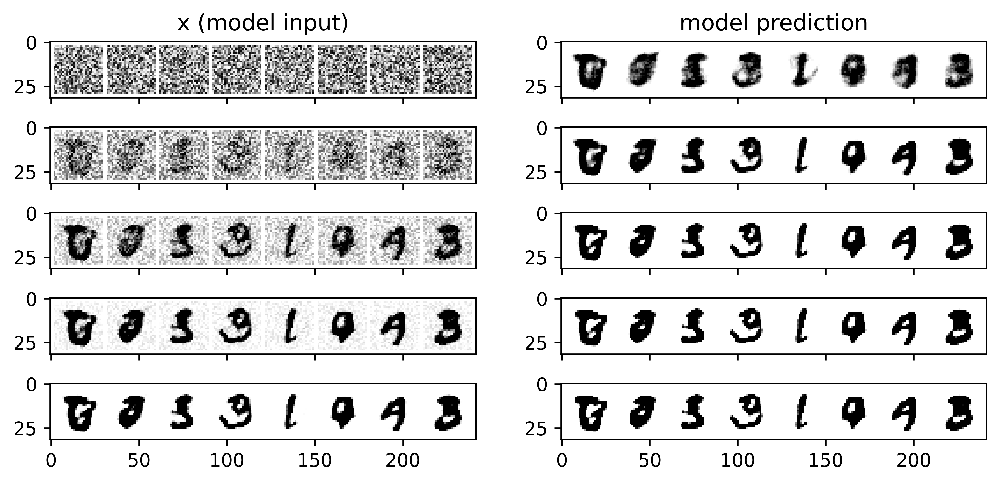
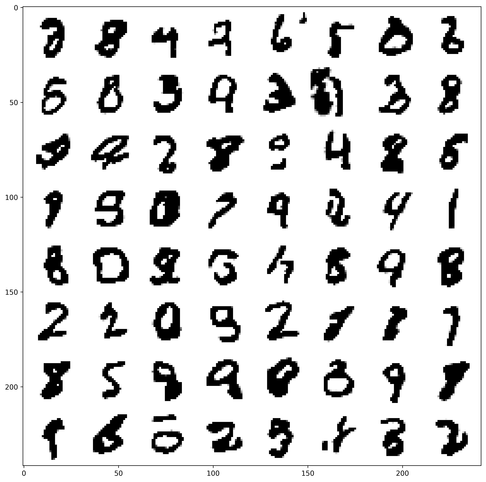

# DiffuseDigits
Diffusion Model for generating monochrome digits (from 0-9), trained on MNIST.

Final Loss (goal of < 0.1): 0.069

After extensive hyperparameter optimization (using both RayTune and custom modules), 
the best (lowest-loss) model is a batch size of 
16, a learning rate of 5e-4 and 10 as the number of epochs.

## Data
The following is an example of the input, and the model's prediction:

An example of generated digits are the following:

As can be seen, viable digits from 0-9 are shown.
The model performs the best for ones (1), eights (8)
and nines (9).